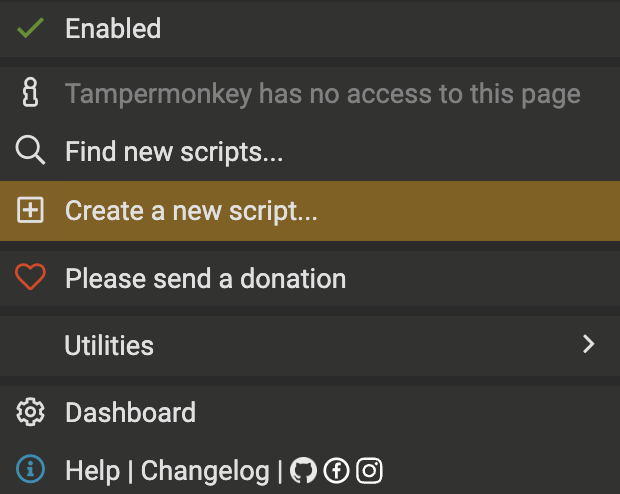

# Algosea Similarity Service

Implementation of the [K-Nearest Neighbors Algorithm](https://www.ibm.com/topics/knn) in 4 dimensional space for fiding similar Algosea Pirates.

# Demo Video


# Backend

The backend works in multiple steps: 

- It takes the 4 attributes (combat, constitution, luck, plunder) of the pirate we want to compare.

- It fetches all the pirates from the list available at `https://d3ohz23ah7.execute-api.us-west-2.amazonaws.com/prod/marketplace/listings?collectionName=AlgoSeas%20Pirates&sortBy=time&sortAscending=false&limit=500` and stores them in an array.

- It computes the euclidian distance between my pirate and all those from the array, then it adds the distance value to each pirate.

- It sorts the array by inscreasing distance.

- Finally, the backend returns the 3-Nearest Neighbors.

The code has been deployed on a serverless worker on Cloudflare. To test it:

```
POST https://algorand-similarity-service.neutrino.workers.dev/find-similar
{
    "combat": 40,
    "constitution": 45,
    "luck": 52,
    "plunder": 38
}
```

Output: 
```
{
    "pirates": [
        {
            "name": "AlgoSeas Pirate #14847",
            "rank": 9957,
            "image": "https://cdn.algoseas.io/pirates/14847-full.png",
            "price": 8000000,
            "combat": 41,
            "constitution": 45,
            "luck": 50,
            "plunder": 44,
            "distance": 6.4031242374328485
        },
        {
            "name": "AlgoSeas Pirate #19780",
            "rank": 774,
            "image": "https://cdn.algoseas.io/pirates/19780-full.png",
            "price": 8000000,
            "combat": 31,
            "constitution": 45,
            "luck": 52,
            "plunder": 34,
            "distance": 9.848857801796104
        },
        {
            "name": "AlgoSeas Pirate #20310",
            "rank": 12275,
            "image": "https://cdn.algoseas.io/pirates/20310-full.png",
            "price": 3000000,
            "combat": 34,
            "constitution": 43,
            "luck": 43,
            "plunder": 39,
            "distance": 11.045361017187261
        }
    ]
}
```

# Frontend

I first developed a dedicated frontend for this, but then decided it would much more ergonomic to create a Tempermonkey script that executes automatically when browser a pirate on the Algoseas marketplace, e.g. https://algoseas.io/marketplace/asset/911883637 

The script displays the nearest neighbors directly on the marketplace!


To add the script to your browser:

- Install [TamperMonkey](https://chrome.google.com/webstore/detail/tampermonkey/dhdgffkkebhmkfjojejmpbldmpobfkfo?hl=en)

- Click `Create a new Script`


- Copy/paste the content of `tampermonkey-script.js`

- Open a marketplace asset, e.g. https://algoseas.io/marketplace/asset/911883637 

- When prompted to grant access to HttpRequest, click 'Always allow'

- Enjoy navigating the marketlace with similar listing displayed automatically on each pirate (refresh your page on the pirate page to load the listing. It takes 3 to 5 seconds to display).
